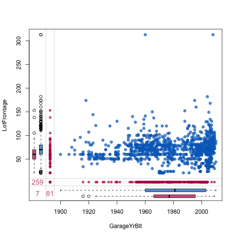
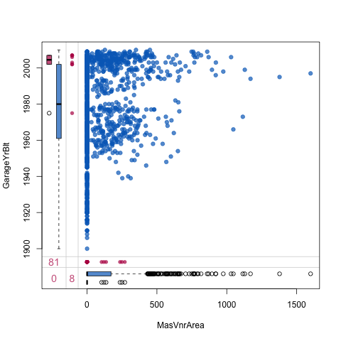
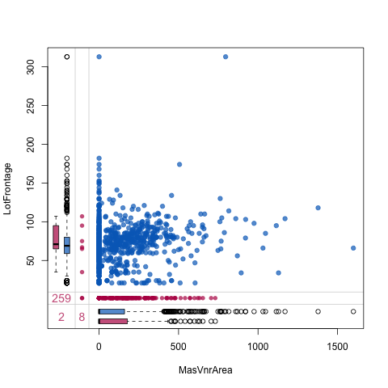

```{r setup, include=FALSE}
knitr::opts_chunk$set(echo = TRUE)
```
# Missingness

## Margin Plots

Blue box plots summarise the distribution of observed data given the other variable is observed, and red box plots summarise the distribution of observed data given the other variable is missing.

Note that, if data are MCAR (Missing completely at random), we expect the blue and red box plots to be identical.

### Garage Year Built vs. Lot Frontage (SF)



Looking at this plot, it seems the missing values for lot frontage area mostly lie within the range of garages built between 1960-2010. Quite a large range. 

On the other hand, missing values for when a garage was built cluster more within frontage areas between 0 and 100 with fewer outlier than the distribution of non-missing years. 


### Masonry Veneer Area (SF) vs, Garage Year Built




Missing values for the size of the masonry veneer are all associated with Garages built after 2000. 

And for low values of masonry veneer area, when a garage was built is more likely to be missing. I don't think that's significant.

### Masonry Veneer Area (SF) vs. Lot Frontage 



The missing data for Lot Frontage for a given size of Masonry Veneer has less outliers


